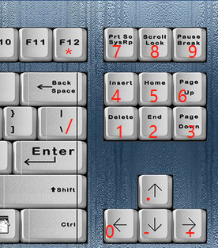

##Usage:
This program can make your keyboard of 87 keys have numeric keyboard , just like 104  keyboard

Running the arrow2enter program can make particular keyboard mapping, or it can be startup when system boot 

###Enter shortcut key
Pressing the Right key within the specified delay milliseconds of holding down the Down key (as described in the configuration file) will trigger Enter.
###Tray menu
1. CapsLock Hold means to press and hold CapsLock while pressing the right direction and Control key, which will be converted to a Numeric keypad. The shortcut key is ctrl+L
2. When CapsLock indicates the right direction and Control key when CapsLock is turned on. It will be converted to a Numeric keypad, and the shortcut key is ctrl+L
3. Suspend Hotkeys means to pause the hotkey response, and the shortcut key ctrl+S
4. Exit, shortcut key ctrl+X

###Keyboard Mapping

| Key | Mapping |
| ---- | ---- |
| Hold Down +  Right | Enter |
| Hold CapsLock or keep in CapsLock state | Small Numpad |
| Left| Numpad0 |
| Up| NumpadDot |
| Del| Numpad1 |
| End| Numpad2 |
| PgDn| Numpad3 |
| Ins| Numpad4 |
| Home| Numpad5 |
| PgUp| Numpad6 |
| PrintScreen| Numpad7 |
| ScrollLock| Numpad8 |
| Pause| Numpad9 |
| Down| NumpadSub |
| Right| NumpadAdd |
| F12 | NumpadMult |
| \ | NumpadDiv |

##Configuration file

The configuration file Arrow2Enter.ini is saved in the same directory as Arrow2Enter.exe, and the default section is [Arrow2Enter]
1. The setting parameters of CapsLock Hold/When are saved in the HoldCapsLock parameters
2. The parameters of repeatMaxMs and repeatMinMs can be modified to control the maximum and minimum interval time when pressing and holding the direction keys. The repetition interval depends on the repetition speed setting of the system's keyboard (range 0-31)
3. The parameters of delayMaxMs and delayMinMs can be modified to control how long the directional keys are pressed continuously, and the delay time depends on the repeated delay setting of the system's keyboard (range 0-3)

