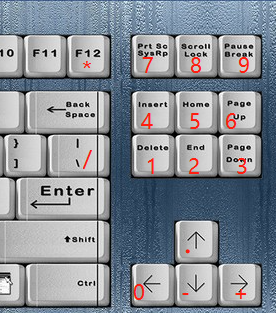

# keyboardA87
87键键盘自定义快捷键

## 原因：

购买了一个87键的机械键盘，发现没有小键盘的Enter键，有时候录入数据的时候都需要用到Enter键，但默认的Enter键不在键盘边缘，为了可以在键盘边缘按键，需求如下：

1. 键盘边缘的 方向键下+方向键右 -> Enter 键
2. 同时支持shift+方向键下 等功能不受影响等
3. 将 右侧9个按键，改为数字1-9，方向键上为 . 号，方向键左为 0 ，方向键右为+ ，方向键下为- ，通过 CapsLock键进行控制，可在托盘右键菜单设置通过按住或大写状态下生效

## 使用方法：

### 回车快捷键

按住 Down键 的指定延时毫秒(见配置文件说明) 时间内按 Right键 ，即可实现回车。

### 托盘菜单

1.  CapsLock Hold 表示 按住CapsLock同时按 右侧方向和控制键，将转换为 数字键盘 ，快捷键 ctrl+L
2.  When CapsLock 表示  CapsLock 打开时  右侧方向和控制键，将转换为 数字键盘，快捷键 ctrl+L
3.  Suspend Hotkeys 表示暂停热键响应，快捷键 ctrl+S
4.  Exit 退出，快捷键 ctrl+X

### 键盘按键映射

| 按键 | 映射       |
| ---- | ---- |
| 先按 Down + 后按 Right | Enter |
| 按住CapsLock 或 CapsLock 打开状态 | 小键盘按键 |
| Left| Numpad0 |
| Up| NumpadDot |
| Del| Numpad1 |
| End| Numpad2 |
| PgDn| Numpad3 |
| Ins| Numpad4 |
| Home| Numpad5 |
| PgUp| Numpad6 |
| PrintScreen| Numpad7 |
| ScrollLock| Numpad8 |
| Pause| Numpad9 |
| Down| NumpadSub |
| Right| NumpadAdd |
| F12 | NumpadMult |
| \ | NumpadDiv |

## 配置文件

配置文件  Arrow2Enter.ini  保存在  Arrow2Enter.exe同目录下，节点默认为[Arrow2Enter]

1. CapsLock Hold / When 的设置参数保存在 HoldCapsLock 参数中
2. 可通过修改 repeatMaxMs 和  repeatMinMs 参数，用于控制长按方向键下时的最大最小的间隔时间，重复间隔取决于系统的键盘的重复速度设置(范围0-31) 
3. 可通过修改 delayMaxMs和  delayMinMs 参数，用于控制长按方向键下多久后连续按键，延时时间取决于系统的键盘的重复延时设置(范围0-3) 

## 编译方法：

需要安装 autohotkey 2.0，用其编译为exe程序，作为自启动即可，已经提供编译后文件下载

## 尝试的方案:

1. 想通过 机械键盘的自定义按键实现，但是发现无效。

因为机械键盘的按键都是，定义1个按键为多个按键的功能，比如定义 A实现同时按下 A,B,C或其他复杂的宏的功能

2. 考虑使用PowerToys的快捷键定义功能，测试后发现无效。

因为这个只支持快捷键的自定义，也就是必须用Ctrl，Alt等控制键开头，我这里只有 Down和Right 不满足

相关下载地址 [Release Release v0.70.1 · microsoft/PowerToys (github.com)](https://github.com/microsoft/PowerToys/releases/tag/v0.70.1) 其他功能还是比较多的

3. 考虑使用 autohotkey工具或自己编写全局键盘捕捉工具

编写 ahk的脚本为

Down & Right::Enter

$Down::Send "{Down}" ; 发送模拟按键 Down。

进行映射，即可实现，唯一的问题就是由于将Down键设置为前置键，所以Down如果长按的话，不会连续响应，需要多次按下

官网 [AutoHotkey](https://www.autohotkey.com/) 相关说明 [热键（鼠标、操纵杆和键盘快捷键） (ahkcn.github.io)](http://ahkcn.github.io/docs/Hotkeys.htm)